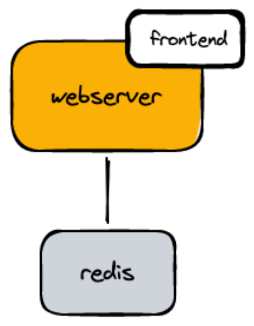
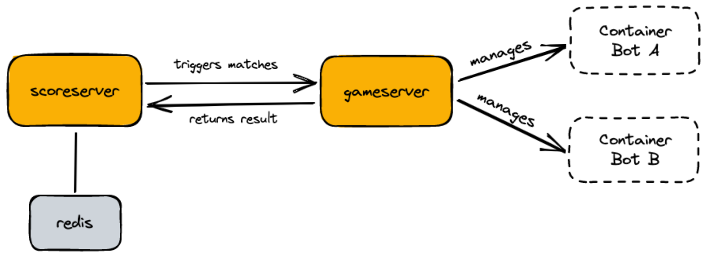

# waboorrt

Install docker compose. Create a network for the bots and run compose up

    docker network create --internal gamenet
    docker-compose up --build

WebUI: http://localhost
Gameserver interface: http://localhost:5000

If you want to work on the application, continue reading.

## App components

The subdirectories *gameserver*, *gitserver*, *scoreserver* and *webserver* are independent
applications which serve different purposes. Please see README.md in each directory to
learn how to set it up.

- gameserver: RPC server. It allows to execute a single match between bots with an API call
- gitserver: Contains a bare repo for each participant. Triggers builds when new software is pushed
- botbuilder: Builds a docker image for a bot. Triggered by gitserver. Shares a docker volume with gitserver
- scoreserver: Regularly triggers new matches. Stores the scores and calculates an ELO score
- webserver: Provides auth to create new accounts. Contains frontend. Shows past games and scores.

## Achitecture overview

### `webserver`

### `scoreserver` and `gameserver`

### `gitserver` and `botbuilder`

## Development setup: gameserver

Use pipenv (`pip install pipenv`).

    cd gameserver/
    # install dependencies
    pipenv sync
    # run tests
    pipenv run nosetests
    # format code
    pipenv run black .
    # check style
    pipenv run flake8

Build the "pyrandom" docker image:

    cd bot-templates/python
    docker build -t localhost/bot/$(printf %s "pyrandom" | sha256sum | head -c 32) .

## gitserver: adding new accounts

    docker-compose exec gitserver newbot username python "ssh-rsa AAAAB...."
    git clone ssh://username@localhost:2222/git/username.git
